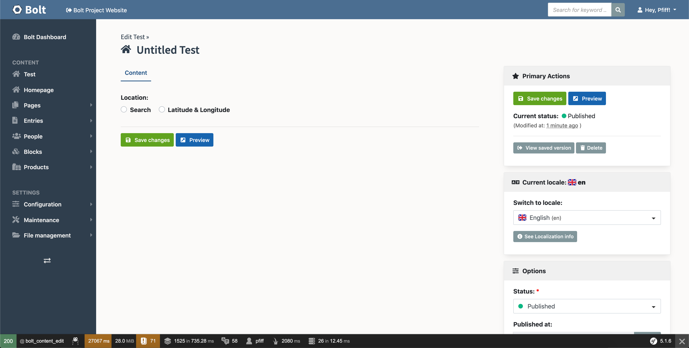
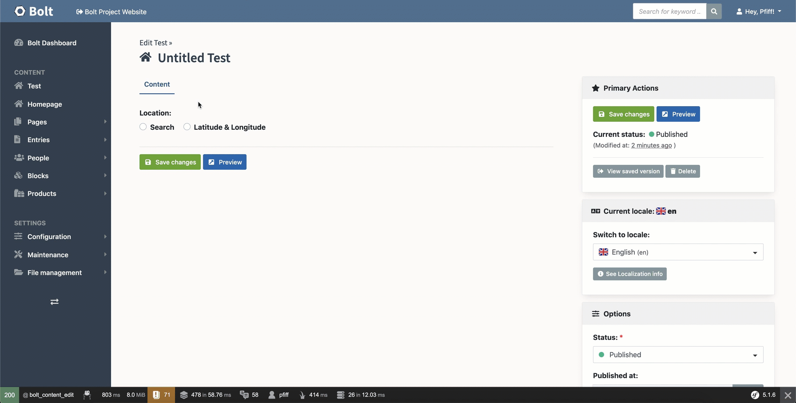
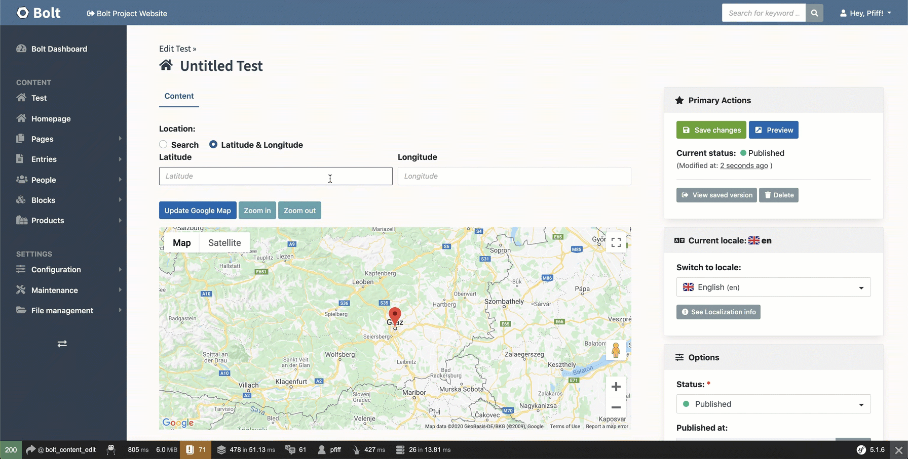

# 📝 Bolt Geolocation Field Extension

**This Extension was written for BoltCMS 4**

This extension allows you to use fields of `type: geolocation` in your 
ContentTypes, as defined in `contenttypes.yaml`

```bash
composer require lordsimal/bolt-geolocation-field 
```

After that you will see a new `config/extensions/bolt-geolocation.yaml` file.

**In here you have to insert your Google Maps JS API Key, otherwise the field won't work correctly!** 

```
# Settings for Bolt Geolocation Field

default:
  apikey: "<my-api-key>"
```

See more about the Google Maps JS API Key bellow.

After that you can create a new field with the fieldtype `geolocation`

```
test:
    name: Test
    singular_name: Test
    fields:
        location:
            type: geolocation
    viewless: false
    taxonomy: [ ]
    locales: ['en', 'nl', 'pt_BR', 'es']
    singleton: true
    icon_many: "fa:home"
    icon_one: "fa:home"
```

With that you can see the field in the backend:



You can search for places by selecting `Search` and then typing your desired place



Or if you have Latitude and Longitude of your location you can input that via the 
`Latitude & Longitude` area.



As you can see in the GIF you need to click the `Update Google Map` button when 
inputting manual Latitude and Longitude.

You can also set the zoom level as you desire


## Google Map API Key

If you don't already have an API key go to https://console.developers.google.com/ 
and create a new project.

After that you have to enable the following API's for this project:

- **Maps JavaScript API**
    - This is needed to create Google Maps via JS
- **Places API**
    - This is needed to have a nice search behaviour when your searching for places

After that you need to create an API Key via the **Credentials** Menu.

I would recommend you to restrict this key at least by **HTTP referrers** so only 
your website can use the API key.

This now generated API key needs to be inserted into your 
`config/extensions/bolt-geolocation.yaml` file.

Finally you will need to create a **Billing Account** under 
https://console.cloud.google.com/billing **AND** link it to your previously 
created API Console project  
https://cloud.google.com/billing/docs/how-to/modify-project#confirm_billing_is_enabled_on_a_project

Google requires you to insert one, otherwise it won't work as desired.

See https://developers.google.com/maps/documentation/javascript/usage-and-billing 
for more information.


## Why did I choose Google Map JS API instead of an embeded version?

Trust me, I tried to implement this without the need of an API key.

But unfortunately Google only allows 1 iFrame per page to be loaded.
https://stackoverflow.com/questions/15388897/google-maps-inside-iframe-not-loading

Therefore you can't have multiple fields defined as `type: geolocation` because
only the first one works and all the others won't.

And since there is (as far as I know) no Map Provider out there, which allows
multiple embeded Maps without an API key I have chosen the most popular one.


## Accessing the values in the frontend

Basically everything in the filed is saved inside a JSON.

BoltCMS returns that JSON as a string, therefore we have to decode it first.

```



  The given field value for <code>{{ record.location.name }}</code> is not a valid json

  

  <div>Selected: {{ location_json.selected }}</div>
  <div>Zoom: {{ location_json.zoom }}</div>
  <div>Search: {{ location_json.search }}</div>
  <div>Latitude: {{ location_json.lat }}</div>
  <div>Longitude: {{ location_json.long }}</div>

```

* **Record** here is the current entry for the content type.
* **location** is the name you have given the filed in the contenttypes.yaml


* **location_json.selected** is either **search** or **latlong**
* **location_json.zoom** is a value between 0 and 19
* **location_json.search** is the searchterm aka the searched location
* **location_json.lat** is the latitude value
* **location_json.long** is the longitude value


### Outputting a simple embedded map with an iframe

If you don't want to output the map yourself with the Google Map JS API 
you can use the data from above to output an embedded map via an `iframe`

```



  The given field value for <code>{{ record.location.name }}</code> is not a valid json

  

  
    
  
    
  
  
  <div class="geolocation-field-iframe-wrapper">
    <iframe class="geolocation-field-iframe"
            src="https://maps.google.com/maps?q={{ gmap_query }}&t=&z={{ location_json.zoom }}&ie=UTF8&iwloc=&output=embed"
            frameborder="0" scrolling="no" marginheight="0" marginwidth="0">
    </iframe>
  </div>

```

I would recommend to you to set the following CSS in your application as well:

```css
.geolocation-field-iframe {
    height: 500px; /* or what height you need */
    width: 100%;
}
.geolocation-field-iframe {
    height: 100%;
    width: 100%;
}
```

> **WARNING**: Google only allows 1 iFrame per URL. See https://stackoverflow.com/questions/15388897/google-maps-inside-iframe-not-loading

Therefore if you need to output multiple maps on one page you will need 
to implement the Google Maps JS API for yourself in your frontend.


## Running PHPStan and Easy Codings Standard

First, make sure dependencies are installed:

```
COMPOSER_MEMORY_LIMIT=-1 composer update
```

And then run ECS:

```
vendor/bin/ecs check src
```