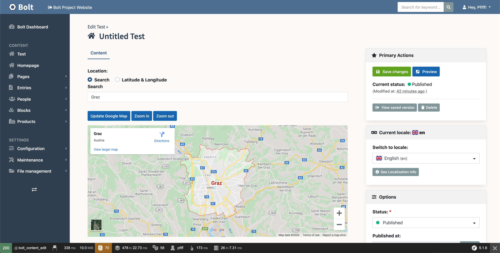

# 📝 Bolt Geolocation Field Extension

This extension allows you to use fields of `type: geolocation` in your 
ContentTypes, as defined in `contenttypes.yaml`

```bash
composer require lordsimal/bolt-geolocation-field 
```

After that you can create a new field with the fieldtype `geolocation`

```
test:
    name: Test
    singular_name: Test
    fields:
        location:
            type: geolocation
    viewless: false
    taxonomy: [ ]
    locales: ['en', 'nl', 'pt_BR', 'es']
    singleton: true
    icon_many: "fa:home"
    icon_one: "fa:home"
```

With that you can see the field in the backend:



You have to click the "Update Google Maps" Button to refresh the preview.


## How is it implemented?

Currently we use the method described here: https://www.embedgooglemap.net/

So basically just an iFrame and therefore no need for an API Key.


### Current Problem

Due to limitations from Google it is currently not allowed to have more then 
1 iFrame per website.

Therefore if you implement 2 fields with this field type you will get the 
following JS error:

```
Refused to display 'https://maps.google.com/maps?q=Graz&t=&z=&ie=UTF8&iwloc=&output=embed' in a frame because it set 'X-Frame-Options' to 'sameorigin'.
```

An old fix for that was to include the `output=embed` GET parameter, but this 
doesn't work any more either.

See https://stackoverflow.com/questions/15388897/google-maps-inside-iframe-not-loading

-------

The part below is only for _developing_ the extension. Not required for general
usage of the extension in your Bolt Project

## Running PHPStan and Easy Codings Standard

First, make sure dependencies are installed:

```
COMPOSER_MEMORY_LIMIT=-1 composer update
```

And then run ECS:

```
vendor/bin/ecs check src
```